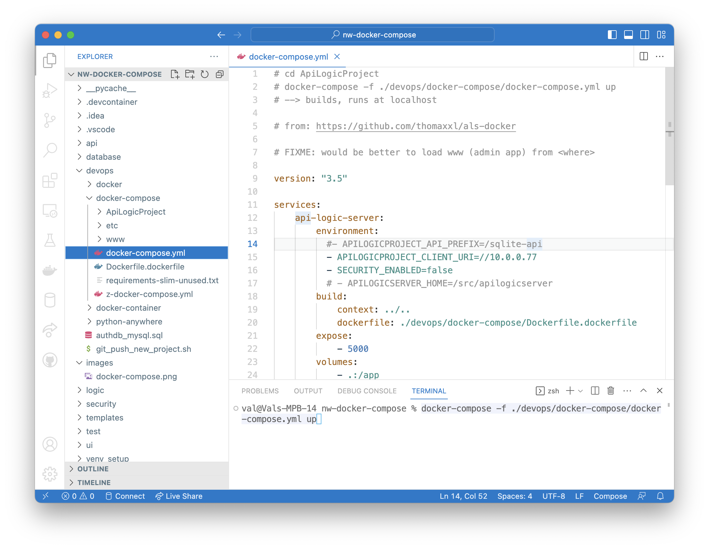

# Posetgres ApiLogicProject using Docker and docker-compose

## Installation

```
# git clone https://github.com/valhuber/postgres-docker-compose.git
# cd postgres-docker-compose
```

## Project



## Configure

To configure the ApiLogicProject, change the environement variables in [`devops/docker-compose/docker-compose.yml`](docker-compose.yml):
```
    api-logic-server:
        environment:
            - APILOGICPROJECT_CLIENT_URI=//192.168.109.130
```

See also entries: `configure-me`.

## Run

> Ensure you are not already running the API Logic Server postgres database in a docker container.  If it's running, you will see port conflicts.

The following will build and deploy the default container stack locally:

```
# cd postgres-docker-compose  # <project-root>
# docker-compose -f ./devops/docker-compose/docker-compose.yml up
```

Then, in your browser, open `localhost`.